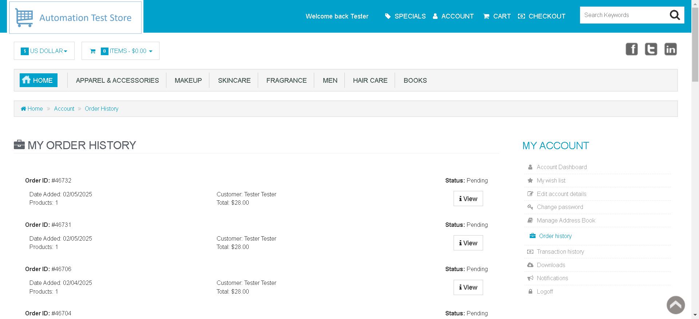
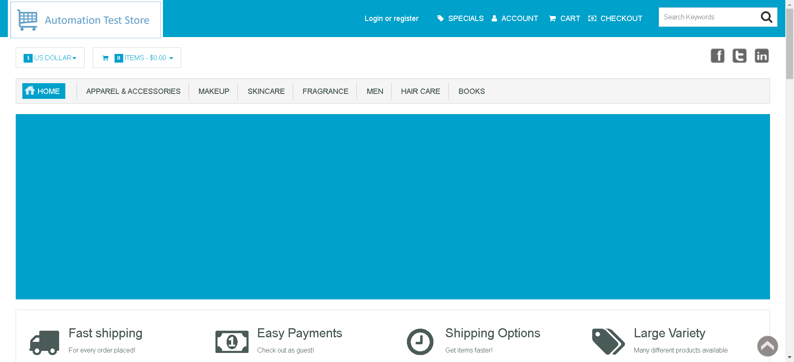

# 🛒 Automation Testing of an E-Commerce Site Using Selenium  

## 🚀 Overview  
This project is an automated testing framework for an e-commerce website using **Selenium WebDriver** and **Java**. The framework ensures functional reliability, performance, and regression testing of key website features.  

## 🛠️ Technologies Used  
- **Eclipse** – IDE for development  
- **Selenium WebDriver** – UI automation  
- **Java** – Programming language  
- **TestNG** – Test framework for execution and assertions  
- **Log4j** – Logging and debugging  
- **Data-Driven Approach** – External data source integration  
- **Extent Reports** – Enhanced reporting and visualization  

## 📌 Features  
✅ Automated UI testing for e-commerce functionalities  
✅ Data-Driven testing with external datasets  
✅ Detailed test reports with screenshots using **Extent Reports**  
✅ Logging and debugging with **Log4j**  
✅ Parallel test execution using **TestNG**  

## 📂 Project Structure  
📁 project-root
┣ 📂 src/main/java # Main test scripts
┣ 📂 src/test/java # Test cases
┣ 📂 test-output # TestNG reports
┣ 📂 logs # Log4j logs
┣ 📂 reports # Extent Reports
┣ 📜 pom.xml (if using Maven)
┣ 📜 README.md (this file)

## 🏁 Setup and Execution  

### 🔹 Prerequisites  
- Install **Java (JDK 8+)**  
- Install **Eclipse IDE**  
- Install **Selenium WebDriver** dependencies  
- Install **TestNG plugin**  
- Configure **Log4j** for logging  
- (Optional) Install **Maven** for dependency management  

  ##ScreenShot:
 

